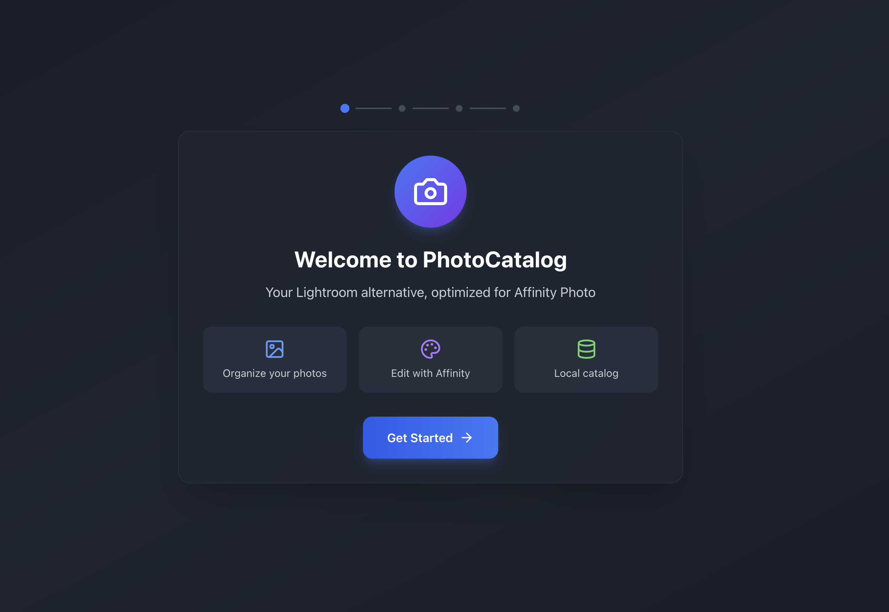
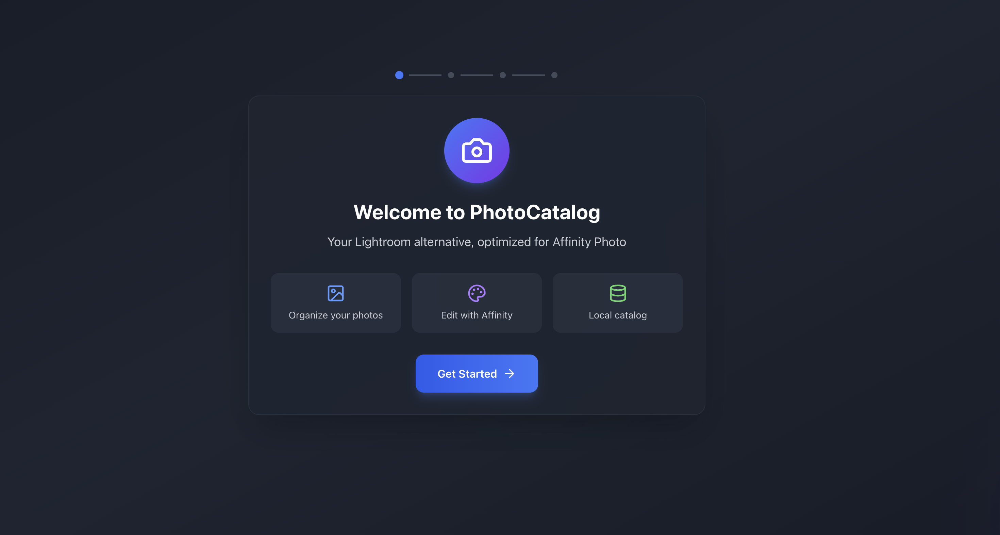
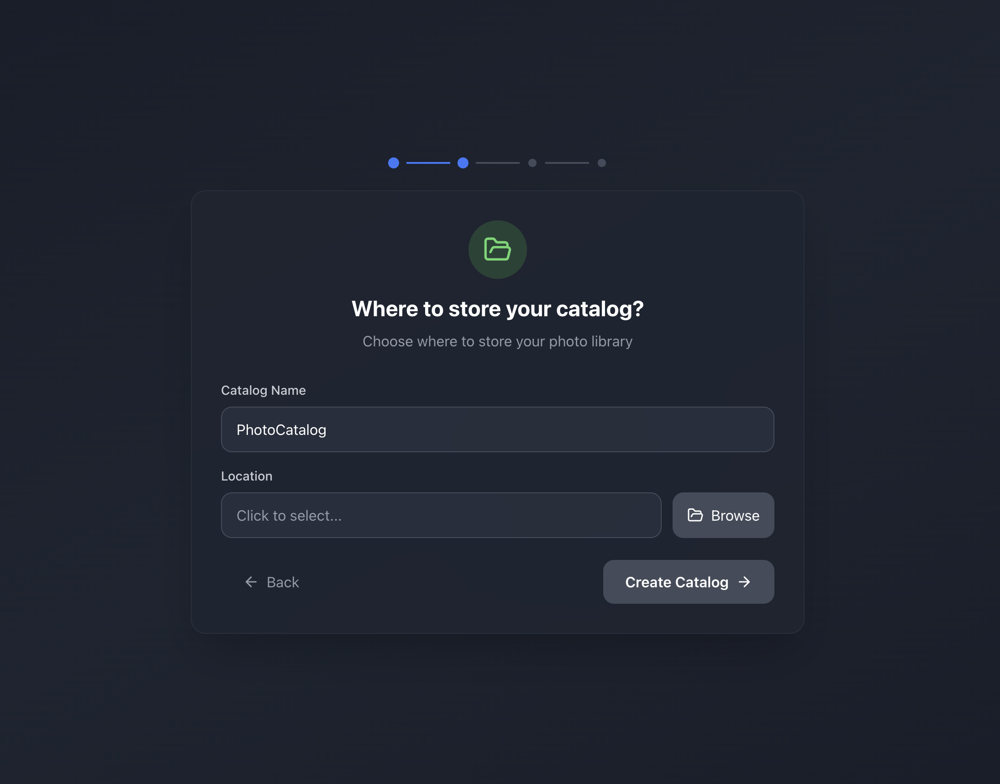

# PhotoCatalog

**Frustrated that Affinity Photo lacks any classification tools? I created PhotoCatalog to bridge that void.**

PhotoCatalog is a professional photo catalog and management application, designed as an open-source alternative to Adobe Lightroom. It integrates seamlessly with Affinity Photo for advanced editing while providing powerful organization features.

## Features

- **Photo Organization**: Catalog, sort, and organize your photo collections
- **RAW Support**: Native support for RAW files from major camera manufacturers
- **Lightroom Migration**: Import your existing Lightroom catalog with ease
- **Affinity Photo Integration**: Sync and edit photos with Affinity Photo
- **Face Recognition**: Automatic face detection and grouping
- **EXIF Metadata**: Full metadata viewing and editing
- **GPS Mapping**: View photo locations on an interactive map
- **Smart Collections**: Organize photos with keywords, ratings, and color labels
- **XMP Sidecar Support**: Non-destructive editing with industry-standard XMP files

## Screenshots

### Grid View


### Loupe View


### Develop Module


## Installation

### Pre-built Releases

Download the latest release for your platform:
- **macOS**: `.dmg` or `.zip`
- **Windows**: `.exe` installer or portable
- **Linux**: `.AppImage` or `.deb`

### Build from Source

```bash
# Clone the repository
git clone https://github.com/WeboSato/PhotoCatalog.git
cd PhotoCatalog

# Install dependencies
npm install

# Rebuild native modules for Electron
npm run rebuild

# Start in development mode
npm run dev

# Build for production
npm run build

# Package for your platform
npm run package:mac    # macOS
npm run package:win    # Windows
npm run package:linux  # Linux
```

## Requirements

- Node.js 18+
- npm 9+
- For development: Xcode Command Line Tools (macOS) or Visual Studio Build Tools (Windows)

### Optional Dependencies

#### Darktable (Recommended for RAW Support)

For advanced RAW file processing, PhotoCatalog can use [Darktable](https://www.darktable.org/) as an external processor. This is **optional** but recommended for best RAW quality.

**Installation:**
- **macOS**: `brew install darktable` or download from [darktable.org](https://www.darktable.org/install/)
- **Windows**: Download installer from [darktable.org](https://www.darktable.org/install/)
- **Linux**: `sudo apt install darktable` or equivalent for your distribution

PhotoCatalog will automatically detect and use `darktable-cli` if installed. Without Darktable, basic RAW preview is still available using built-in tools.

#### Affinity Photo (Recommended for Editing)

For advanced photo editing, install [Affinity Photo](https://affinity.serif.com/photo/). PhotoCatalog integrates seamlessly with Affinity Photo:
- Open photos directly in Affinity Photo
- Automatic detection of edited files
- Non-destructive workflow with original preservation

## Usage

1. **Create a new catalog** or import an existing Lightroom catalog
2. **Add folders** containing your photos
3. **Organize** with keywords, ratings, and color labels
4. **Edit** photos directly in Affinity Photo with automatic syncing
5. **Export** your organized collections

## Migrating from Lightroom

PhotoCatalog can import your existing Lightroom catalog:

1. Go to **File > Import Lightroom Catalog**
2. Select your `.lrcat` file
3. Choose which collections to import
4. PhotoCatalog will preserve your ratings, keywords, and organization

## Contributing

We welcome contributions! Please see [CONTRIBUTING.md](CONTRIBUTING.md) for guidelines.

### Ways to Contribute

- Report bugs and suggest features via [Issues](https://github.com/WeboSato/PhotoCatalog/issues)
- Submit pull requests for bug fixes or new features
- Improve documentation
- Share your workflows and tips with the community

## Tech Stack

- **Electron** - Cross-platform desktop application
- **React** - User interface
- **TypeScript** - Type-safe development
- **SQLite** - Local database (better-sqlite3)
- **Sharp** - Image processing
- **face-api.js** - Face recognition
- **Tailwind CSS** - Styling
- **Vite** - Build tooling

## License

This project is licensed under the MIT License - see the [LICENSE](LICENSE) file for details.

## Acknowledgments

- Inspired by Adobe Lightroom's workflow and [Darktable](https://www.darktable.org/)'s processing pipeline
- Built to complement [Affinity Photo](https://affinity.serif.com/photo/)
- RAW processing powered by [Darktable](https://www.darktable.org/) (optional)
- Thanks to all contributors and the open-source community

---

**Join our community!** Share your ideas, creativity, and solutions. Together, let's build something truly extraordinary.
